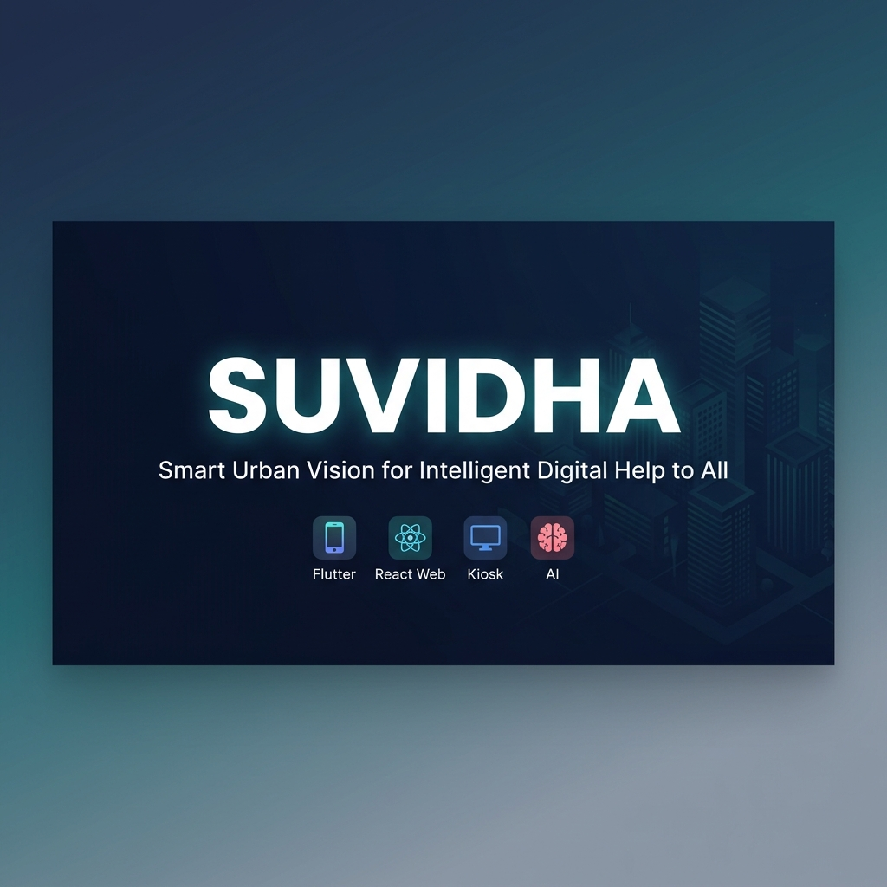
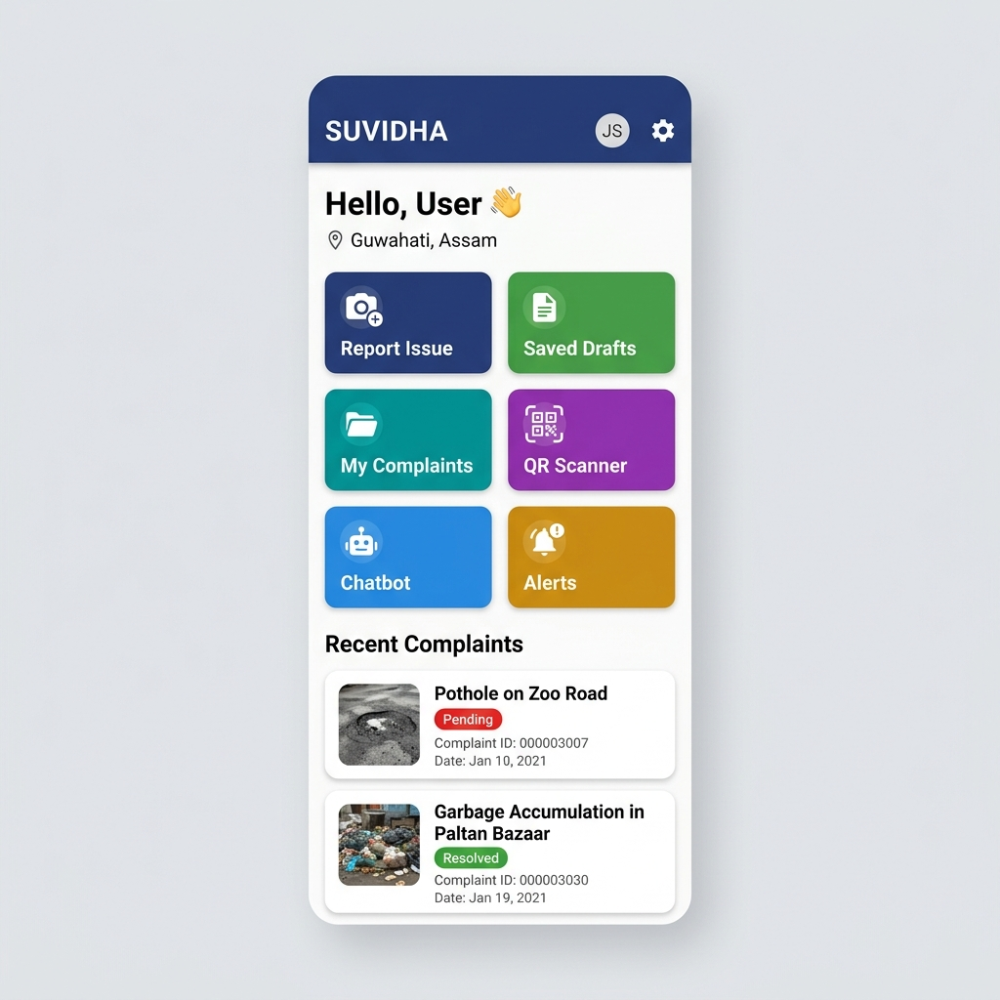
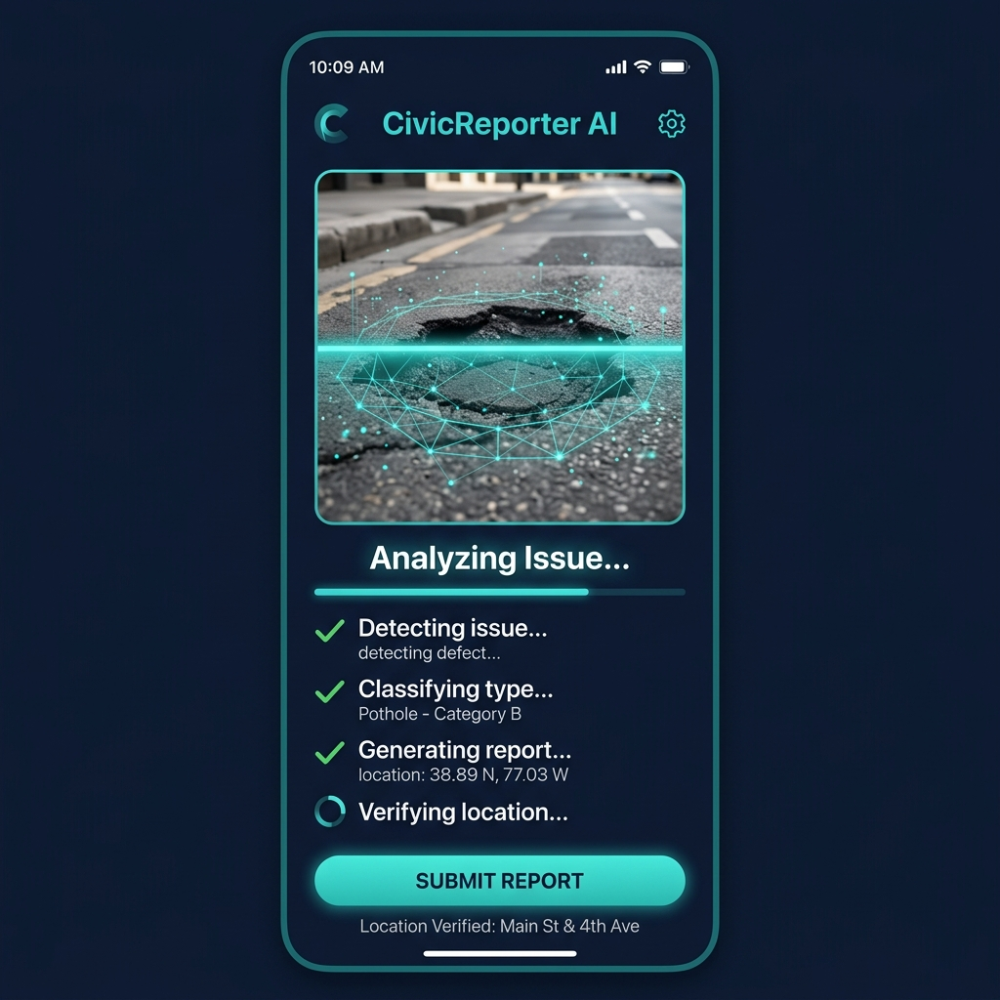
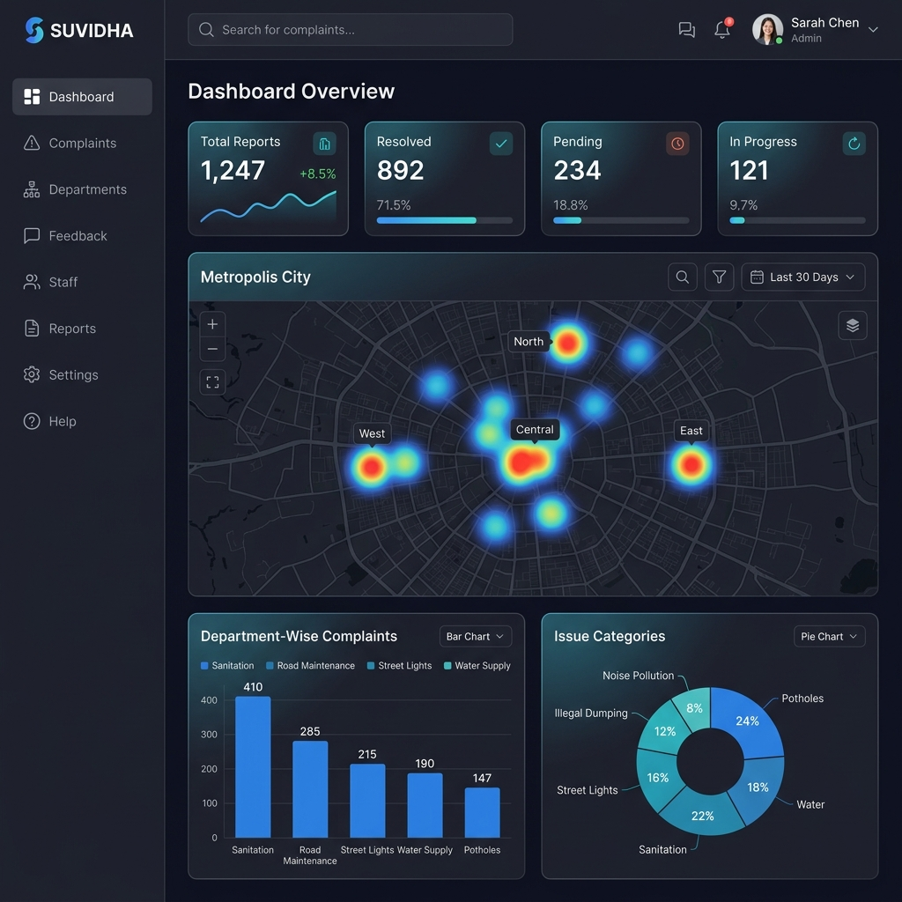
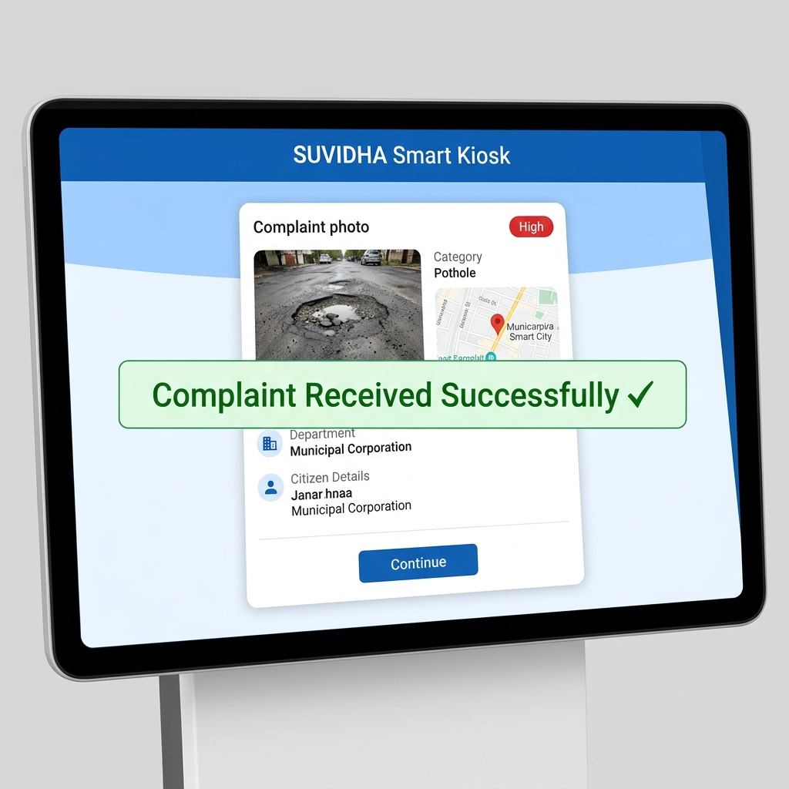

<div align="center">



<br/>
<br/>

# 🏙️ SUVIDHA

### **S**mart **U**rban **V**ision for **I**ntelligent **D**igital **H**elp to **A**ll

*A full-stack AI-powered civic intelligence platform connecting citizens, kiosks, and government agencies*

<br/>

[](https://flutter.dev/)
[](https://react.dev/)
[](https://nodejs.org/)
[](https://python.org/)
[](https://ai.google.dev/)
[](LICENSE)

<br/>

[📱 Mobile App](#-mobile-app) · [🌐 Web Dashboard](#-web-dashboard) · [🖥️ Kiosk Terminal](#%EF%B8%8F-kiosk-terminal) · [⚙️ Setup](#%EF%B8%8F-installation--setup) · [📖 Architecture](#-system-architecture)

</div>

---

## 🎯 What is SUVIDHA?

**SUVIDHA** is a complete smart-city civic complaint management ecosystem. Citizens snap a photo of any urban issue — potholes, garbage, gas leaks, broken streetlights — and our **Gemini Vision AI** instantly classifies the problem, auto-fills the report, and routes it to the right government department.

The platform bridges the gap between citizens and municipalities through **three integrated interfaces**:

| Interface | Purpose | Tech |
|-----------|---------|------|
| 📱 **Mobile App** | Citizens report issues via camera + AI | Flutter + Gemini API |
| 🌐 **Web Dashboard** | Admins manage, analyze, and track reports | React + Vite |
| 🖥️ **Kiosk Terminal** | Public kiosks receive reports via QR sync | React + Node.js |

---

## ✨ Key Features

<table>
<tr>
<td width="50%">

### 🤖 AI-Powered Detection
- Gemini Vision API analyzes uploaded photos
- Auto-classifies issue type (8 categories)
- Generates severity rating & department assignment
- AI-authored description for each report

### 📍 Smart Location
- GPS-based auto-location with map pin adjustment
- Reverse geocoding for address, city, state, pincode
- Optional landmark tagging
- OpenStreetMap integration (no API key needed)

### 🔄 QR Kiosk Sync
- Scan kiosk QR → instant payload transfer
- Session-based real-time sync via polling
- Compressed payloads to prevent 413 errors
- Works offline with draft-save fallback

</td>
<td width="50%">

### 🗂️ Complaint Lifecycle
- Full status tracking: Pending → Accepted → In Progress → Resolved
- Timeline events with timestamps
- Draft save & resume capability
- Department-wise filtering & search

### 🌍 Multi-Language Support
- English, Hindi (हिंदी), Assamese (অসমীয়া)
- Runtime language switching
- Complete UI translation

### 🏛️ Government Dashboard
- Live heatmap of complaint clusters
- Department-wise analytics & charts
- Role-based access (Admin, Officer, Dept Head)
- AI predictions for infrastructure failures
- Voice commands for hands-free operation

</td>
</tr>
</table>

---

## 📸 Screenshots

<div align="center">

<table>
<tr>
<td align="center" width="25%">

<br/>
<sub><b>📱 Home Dashboard</b></sub>
</td>
<td align="center" width="25%">

<br/>
<sub><b>🤖 AI Issue Detection</b></sub>
</td>
<td align="center" width="25%">

<br/>
<sub><b>🌐 Admin Dashboard</b></sub>
</td>
<td align="center" width="25%">

<br/>
<sub><b>🖥️ Kiosk Terminal</b></sub>
</td>
</tr>
</table>

</div>

---

## 📁 Project Structure

```
SUVIDHA/
│
├── 📱 mobile-app/                # Flutter mobile application
│   ├── lib/
│   │   ├── config/               # Theme, routes, constants, localization
│   │   ├── models/               # Data models (Complaint, UserProfile)
│   │   ├── providers/            # State management (Provider pattern)
│   │   ├── screens/              # UI screens organized by feature
│   │   │   ├── auth/             #   Login & OTP verification
│   │   │   ├── home/             #   Main dashboard
│   │   │   ├── report/           #   Capture → AI → Location → Draft → QR
│   │   │   ├── complaints/       #   List & detail views
│   │   │   ├── scanner/          #   QR scanner for kiosk sync
│   │   │   ├── chatbot/          #   In-app assistant
│   │   │   ├── bills/            #   Utility bill payments
│   │   │   ├── profile/          #   User profile management
│   │   │   └── notifications/    #   Alert center
│   │   ├── services/             # AI, Location, Kiosk sync, Storage
│   │   └── widgets/              # Reusable UI components
│   ├── assets/                   # Images, icons, animations
│   └── pubspec.yaml              # Flutter dependencies
│
├── 🌐 web-dashboard/            # React admin dashboard
│   ├── src/
│   │   ├── components/           # Navbar, Chatbot, Sidebar, Auth
│   │   ├── pages/                # Dashboard, Departments, Analytics
│   │   ├── context/              # Auth & theme context
│   │   ├── hooks/                # Custom React hooks
│   │   ├── lingo/                # i18n translations
│   │   └── styles/               # CSS modules
│   └── package.json
│
├── 🖥️ kiosk-app/                # Kiosk frontend (React)
│   ├── src/
│   │   ├── components/           # Kiosk-specific UI components
│   │   ├── pages/                # Complaint receive, QR display
│   │   └── hooks/                # Polling & sync hooks
│   └── package.json
│
├── ⚡ kiosk-backend/             # Kiosk sync server (Node.js)
│   ├── server.js                 # Express server with session store
│   └── package.json
│
├── 🐍 backend/                   # Main backend API (Python Flask)
│   ├── app.py                    # Flask application factory
│   ├── models.py                 # SQLAlchemy database models
│   ├── auth_utils.py             # JWT authentication helpers
│   └── requirements.txt
│
├── 📄 docs/                      # Documentation & screenshots
│   ├── screenshots/
│   └── suvidha_banner.png
│
├── .gitignore
├── LICENSE
└── README.md                     # ← You are here!
```

---

## 🏗️ System Architecture

```
┌──────────────────────────────────────────────────────────────────┐
│                        SUVIDHA ECOSYSTEM                         │
├──────────────────────────────────────────────────────────────────┤
│                                                                  │
│   ┌─────────────┐    ┌──────────────┐    ┌─────────────────┐    │
│   │  📱 Mobile   │    │  🌐 Web       │    │  🖥️ Kiosk       │    │
│   │    App       │    │  Dashboard   │    │   Terminal      │    │
│   │  (Flutter)   │    │  (React)     │    │   (React)       │    │
│   └──────┬──────┘    └──────┬───────┘    └────────┬────────┘    │
│          │                  │                      │             │
│          ▼                  ▼                      ▼             │
│   ┌─────────────┐    ┌──────────────┐    ┌─────────────────┐    │
│   │ Gemini AI   │    │ Flask API    │    │ Node.js Sync    │    │
│   │ (Direct)    │    │ Backend      │    │ Server          │    │
│   └──────┬──────┘    └──────┬───────┘    └────────┬────────┘    │
│          │                  │                      │             │
│          └──────────────────┼──────────────────────┘             │
│                             ▼                                    │
│                    ┌────────────────┐                            │
│                    │  PostgreSQL /  │                            │
│                    │  Hive (Local)  │                            │
│                    └────────────────┘                            │
└──────────────────────────────────────────────────────────────────┘
```

### How the QR Sync Works

```
   📱 Mobile App                    ⚡ Kiosk Backend                   🖥️ Kiosk
   ─────────────                    ───────────────                   ──────────
        │                                 │                               │
        │    1. Scan Kiosk QR             │                               │
        │    (contains session ID)        │     2. Display QR             │
        │    ◄────────────────────────────┤────────────────────────────►  │
        │                                 │                               │
        │    3. POST /complaint-sync/:id  │                               │
        │    ────────────────────────────►│                               │
        │         (JSON payload)          │                               │
        │                                 │    4. GET /complaint-sync/:id │
        │                                 │◄────────────────────────────  │
        │                                 │    (polls until data arrives) │
        │                                 │                               │
        │    5. ✅ Success response       │    6. 📋 Complaint displayed  │
        │    ◄────────────────────────────│────────────────────────────►  │
```

---

## ⚙️ Installation & Setup

### Prerequisites

| Tool | Version | Purpose |
|------|---------|---------|
| Flutter SDK | 3.7+ | Mobile app development |
| Node.js | 18+ | Web dashboard, kiosk app & backend |
| Python | 3.10+ | Main backend API |
| Gemini API Key | — | [Get one free](https://ai.google.dev/) |

---

### 📱 Mobile App

```bash
cd mobile-app

# Install dependencies
flutter pub get

# Configure Gemini API key
# Edit lib/config/constants.dart → replace 'your-gemini-api-key' with your key

# Run on device/emulator
flutter run

# Build APK
flutter build apk --release
```

> **Note**: The app works in **demo mode** without an API key — it uses mock AI responses for testing.

---

### 🌐 Web Dashboard

```bash
cd web-dashboard

# Install dependencies
npm install

# Start development server
npm run dev
```

Runs at `http://localhost:5173`

---

### 🖥️ Kiosk App

```bash
cd kiosk-app

# Install dependencies
npm install

# Start kiosk frontend
npm run dev
```

---

### ⚡ Kiosk Backend (Sync Server)

```bash
cd kiosk-backend

# Install dependencies
npm install

# Start sync server
node server.js
```

Runs at `http://localhost:5000`

---

### 🐍 Backend API

```bash
cd backend

# Create virtual environment
python -m venv venv
source venv/bin/activate    # Windows: venv\Scripts\activate

# Install dependencies
pip install -r requirements.txt

# Configure environment
cp .env.example .env
# Edit .env with your database URL and API keys

# Run server
python app.py
```

---

## 🛠️ Tech Stack

<div align="center">

| Layer | Technology | Purpose |
|-------|-----------|---------|
| **Mobile** | Flutter 3.7, Dart, Provider, GoRouter | Cross-platform citizen app |
| **AI Engine** | Google Gemini Vision API | Image analysis & classification |
| **Web Frontend** | React 18, Vite 5, Tailwind CSS | Admin dashboard & analytics |
| **Kiosk Frontend** | React, Vite, Tailwind CSS | Public kiosk interface |
| **Sync Server** | Node.js, Express | QR-based complaint transfer |
| **Backend API** | Python, Flask, SQLAlchemy | REST API & business logic |
| **Database** | Hive (mobile), PostgreSQL (server) | Data persistence |
| **Maps** | OpenStreetMap, flutter_map, Leaflet.js | Geo-tagging & heatmaps |
| **Charts** | Recharts | Analytics visualization |
| **Localization** | Custom i18n (EN, HI, AS) | Multi-language support |

</div>

---

## 🤖 AI Integration Deep Dive

SUVIDHA uses **Google Gemini Vision API** directly from the mobile app for zero-latency image analysis:

```
┌──────────────┐     ┌────────────────┐     ┌──────────────────┐
│  📷 Camera    │────▶│  Image Resize  │────▶│  Gemini Vision   │
│  Capture     │     │  & Compress    │     │  API (Direct)    │
└──────────────┘     └────────────────┘     └────────┬─────────┘
                                                      │
                     ┌────────────────┐     ┌─────────▼─────────┐
                     │  Auto-fill     │◄────│  JSON Response    │
                     │  Report Form   │     │  Parse & Validate │
                     └────────────────┘     └───────────────────┘
```

### AI Classification Output

| Field | Description | Example |
|-------|-------------|---------|
| `issueType` | Category from 8 predefined types | `pothole` |
| `severity` | Urgency assessment | `Critical - Safety Hazard` |
| `priority` | Low / Medium / High | `high` |
| `description` | Human-readable report | *"Large pothole on main road..."* |
| `department` | Responsible government body | `Municipal Corporation` |
| `confidenceScore` | AI confidence (0.0 - 1.0) | `0.92` |

### Supported Issue Types

| # | Issue | Icon | Department |
|---|-------|------|-----------|
| 1 | Pothole | 🕳️ | Municipal Corporation |
| 2 | Garbage Dump | 🗑️ | Sanitation Department |
| 3 | Gas Leak | ⛽ | Gas Authority |
| 4 | Streetlight Failure | 💡 | Electricity Department |
| 5 | Electricity Theft | ⚡ | Electricity Department |
| 6 | Water Leakage | 💧 | Water Supply Board |
| 7 | Road Damage | 🛣️ | Public Works Department |
| 8 | Drainage Problem | 🚰 | Drainage Department |

---

## 🔐 Role-Based Access

| Role | Platform | Capabilities |
|------|----------|-------------|
| **Citizen** | Mobile App | Report issues, track status, pay bills, chatbot |
| **Field Officer** | Web Dashboard | Receive tasks, update status, verify resolutions |
| **Dept Head** | Web Dashboard | Manage department-specific reports |
| **Gov Admin** | Web Dashboard | Full analytics, AI predictions, heatmap, HRMS |
| **Super Admin** | Web Dashboard | User management, system configuration |

---

## 📡 API Endpoints

### Kiosk Sync Server

| Method | Endpoint | Description |
|--------|----------|-------------|
| `POST` | `/api/complaint-sync/:sessionId` | Mobile app sends complaint payload |
| `GET` | `/api/complaint-sync/:sessionId` | Kiosk polls for synced data |
| `POST` | `/api/complaint-sync/:sessionId/clear` | Clear session after receipt |

### Backend API

| Method | Endpoint | Auth | Description |
|--------|----------|------|-------------|
| `POST` | `/api/auth/register` | — | Create new user |
| `POST` | `/api/auth/login` | — | Get JWT token |
| `GET` | `/api/reports` | Optional | List all reports |
| `POST` | `/api/reports` | Required | Create report |
| `POST` | `/api/detection/analyze` | Required | AI image analysis |
| `GET` | `/api/gov/predictions` | Admin | AI predictions |
| `GET` | `/api/gov/analytics` | Admin | Dashboard stats |
| `GET` | `/api/health` | — | Server health check |

---

## 🚀 Deployment

### Mobile App
```bash
flutter build apk --release          # Android APK
flutter build appbundle --release    # Android AAB (Play Store)
flutter build ios --release          # iOS (requires macOS)
```

### Web Dashboard (Vercel)
```bash
cd web-dashboard
npm run build    # Output: dist/
# Deploy dist/ to Vercel, Netlify, or any static host
```

### Backend (Railway/Render)
```bash
# Start command:
gunicorn app:app --bind 0.0.0.0:$PORT
```

---

## 🤝 Contributing

Contributions are welcome! Please follow these steps:

1. **Fork** the repository
2. **Create** your feature branch (`git checkout -b feature/amazing-feature`)
3. **Commit** your changes (`git commit -m 'Add amazing feature'`)
4. **Push** to the branch (`git push origin feature/amazing-feature`)
5. **Open** a Pull Request

---

## 📄 License

This project is licensed under the **MIT License** — see the [LICENSE](LICENSE) file for details.

---

## 👥 Contributors

<table>
<tr>
<td align="center">
<b>Pushpendra Suryawanshi</b><br/>
<sub>Mobile App Development</sub>
</td>
<td align="center">
<b>Tejasva Gupta</b><br/>
<sub>Web Dashboard & Backend</sub>
</td>
</tr>
</table>

---

<div align="center">

**Built with ❤️ for smarter cities**

*SUVIDHA — Making civic reporting effortless with AI*

⭐ Star this repo if you find it useful!

</div>
